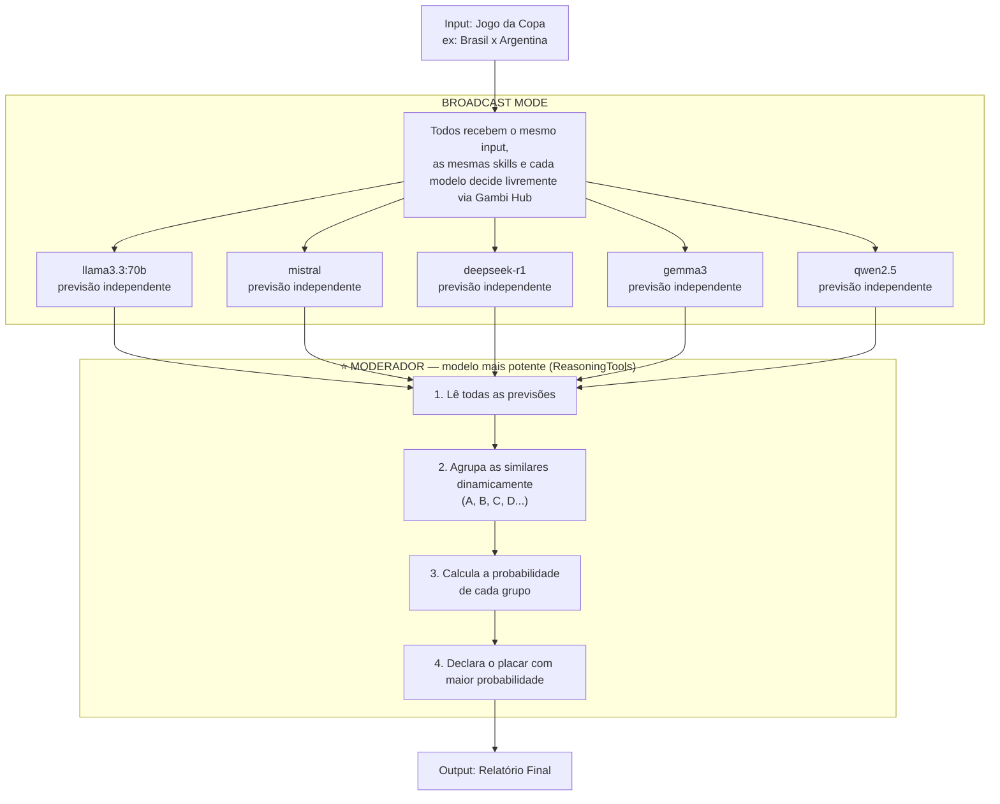

# ⚽ World Cup Score Predictor — Distributed Multi-Model Debate

Sistema distribuído onde múltiplas pessoas conectam seus modelos locais via **Gambi Hub**,
cada um analisa o mesmo jogo de forma independente com as mesmas skills, e o modelo
com mais poder de processamento atua como **moderador** — agrupando os resultados
dinamicamente e calculando a probabilidade de cada previsão.

---

## Arquitetura



---

## Output Esperado

O moderador cria os grupos dinamicamente — podem ser 2, 3 ou mais:

```
📊 PREVISÃO: Brasil x Argentina — Copa do Mundo 2026

GRUPO A — 60% de probabilidade
  Placar: Brasil 2 x 1 Argentina
  Modelos: llama3.3:70b, mistral, deepseek-r1
  Argumentos:
    - Brasil com melhor xG nos últimos 5 jogos
    - Sentimento popular 72% favorável ao Brasil no X
    - Argentina sem Messi em forma plena

GRUPO B — 20% de probabilidade
  Placar: Empate 1 x 1
  Modelos: gemma3
  Argumentos:
    - Histórico de empates em fases de grupos
    - Defesa argentina sólida nos últimos 3 jogos

GRUPO C — 20% de probabilidade
  Placar: Argentina 1 x 0 Brasil
  Modelos: qwen2.5
  Argumentos:
    - Argentina venceu os últimos 2 confrontos diretos

🎯 Previsão Final: Brasil 2 x 1 Argentina (60% de confiança)
```

---

## Setup com Gambi

### 1. Subir o Hub
Escolha uma máquina na rede (não precisa de GPU):

```bash
# Interativo:
gambi hub serve

# Ou com flags:
gambi hub serve --port 3000 --mdns
```

### 2. Criar a Room

```bash
gambi room create --name "worldcup-debate"
# Output: Room created! Code: ABC123
```

### 3. Cada participante conecta seu modelo

```bash
# Ollama (padrão — localhost:11434)
gambi participant join \
  --room ABC123 \
  --participant-id joao-llama \
  --model llama3.3:70b

# LM Studio
gambi participant join \
  --room ABC123 \
  --participant-id maria-mistral \
  --model mistral \
  --endpoint http://localhost:1234

# vLLM
gambi participant join \
  --room ABC123 \
  --participant-id pedro-deepseek \
  --model deepseek-r1 \
  --endpoint http://localhost:8000
```

> ⭐ **O participante com mais poder de processamento deve ser designado como moderador** — idealmente o modelo com mais parâmetros ou GPU mais potente.

---

## Skills dos Agentes

Todos os agentes recebem as **mesmas skills** — a diferença está apenas no modelo local de cada participante.

```
skills/
├── stats-skill/
│   ├── SKILL.md              # xG, posse, gols, defesa, confrontos diretos
│   └── scripts/
│       └── fetch_stats.py    # APIs esportivas (ex: football-data.org)
│
├── tactical-skill/
│   ├── SKILL.md              # Formações, escalações, lesões, clima
│   └── references/
│       └── formations.md
│
└── sentiment-skill/
    ├── SKILL.md              # Opinião popular do X, Reddit, sites
    └── scripts/
        └── fetch_sentiment.py
```

---

## Código Base

```python
from agno.agent import Agent
from agno.team import Team
from agno.team.mode import TeamMode
from agno.tools.reasoning import ReasoningTools
from agno.models.openai.like import OpenAILike
from agno.skills import Skills, LocalSkills

# --- Skills compartilhadas ---
stats_skill    = Skills(loaders=[LocalSkills("skills/stats-skill")])
tactical_skill = Skills(loaders=[LocalSkills("skills/tactical-skill")])
sentiment_skill = Skills(loaders=[LocalSkills("skills/sentiment-skill")])

HUB_URL = "http://hub-ip:3000/v1"  # endpoint do Gambi Hub

SHARED_INSTRUCTIONS = [
    "Analise o jogo usando dados estatísticos (xG, posse, gols, defesa).",
    "Considere o sentimento popular do X e Reddit.",
    "Avalie táticas, escalações, lesões e condições do jogo.",
    "Declare seu placar previsto com justificativa clara.",
    "Seja independente — chegue à sua própria conclusão.",
]

# Participantes conectados ao Gambi Hub
PARTICIPANTS = [
    {"name": "João - Llama3",    "model": "llama3.3:70b"},
    {"name": "Maria - Mistral",  "model": "mistral"},
    {"name": "Pedro - DeepSeek", "model": "deepseek-r1"},
    {"name": "Ana - Gemma3",     "model": "gemma3"},
    {"name": "Carlos - Qwen",    "model": "qwen2.5"},
]

# ⭐ Moderador — participante com mais poder de processamento
MODERATOR_MODEL = "qwen2.5:72b"  # troque pelo modelo mais potente disponível

def make_agent(name, model_id):
    return Agent(
        name=name,
        model=OpenAILike(
            id=model_id,
            base_url=HUB_URL,
            api_key="gambi",  # local não precisa de key real
            skills=[stats_skill,tactical_skill,sentiment_skill],
        ),
        role="Analista independente de futebol",
        instructions=SHARED_INSTRUCTIONS,
    )

agents = [make_agent(p["name"], p["model"]) for p in PARTICIPANTS]

moderator = Team(
    name="World Cup Debate Team",
    mode=TeamMode.broadcast,
    model=OpenAILike(
        id=MODERATOR_MODEL,
        base_url=HUB_URL,
        api_key="gambi",
    ),
    members=agents,
    tools=[ReasoningTools(add_instructions=True)],
    instructions=[
        "Você é o moderador. Após receber as previsões de todos os modelos:",
        "1. Agrupe os modelos que chegaram ao mesmo placar ou placar similar.",
        "2. Crie quantos grupos forem necessários (A, B, C, D...) — não force agrupamentos.",
        "3. Calcule a porcentagem de cada grupo sobre o total de modelos.",
        "4. Liste os principais argumentos de cada grupo.",
        "5. Declare o placar com maior probabilidade como previsão final.",
        "Apresente o resultado em formato de relatório claro com markdown.",
    ],
    show_members_responses=True,
    markdown=True,
)

if __name__ == "__main__":
    moderator.print_response(
        "Jogo: Brasil x Argentina — Copa do Mundo 2026, Fase de Grupos",
        stream=True,
        show_full_reasoning=True,
    )
```

---

## Stack & Referências

| Componente | Descrição | Link |
|---|---|---|
| Gambi Hub | Conecta modelos locais distribuídos em rede | [gambi.sh/reference/cli](https://www.gambi.sh/reference/cli/) |
| OpenAILike | Aponta qualquer endpoint OpenAI-compatible | [docs.agno.com/models/providers/openai-like](https://docs.agno.com/models/providers/openai-like) |
| Broadcast Mode | Todos os agentes recebem o mesmo input em paralelo | [docs.agno.com/examples/teams/modes/broadcast/debate](https://docs.agno.com/examples/teams/modes/broadcast/debate) |
| ReasoningTools | Raciocínio estruturado no moderador | [docs.agno.com/reasoning/usage/tools/reasoning-tool-team](https://docs.agno.com/reasoning/usage/tools/reasoning-tool-team) |
| Teams Overview | Como times funcionam no Agno | [docs.agno.com/teams/overview](https://docs.agno.com/teams/overview) |

---

A lógica principal: o moderador é **apenas mais um participante do Gambi Hub**, mas é o modelo designado com mais poder — ele recebe todos os resultados via broadcast e agrupa dinamicamente.

```suggestions
(OpenAI-compatible models)[/models/providers/openai-like]
(Broadcast Mode Debate)[/examples/teams/modes/broadcast/debate]
(Team with Reasoning Tools)[/reasoning/usage/tools/reasoning-tool-team]
```