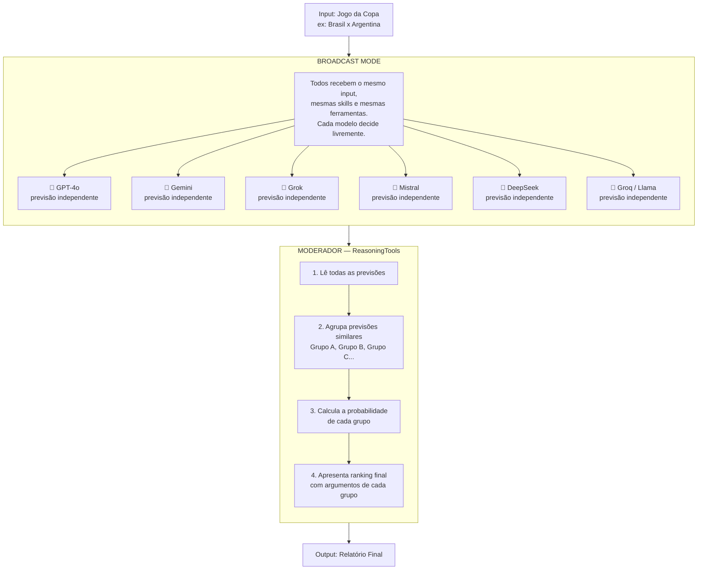

# ⚽ World Cup Score Predictor — Multi-Model Debate System

Sistema onde múltiplos modelos de IA independentes analisam o mesmo jogo com as mesmas skills e ferramentas. Cada um chega à sua própria conclusão livremente. O moderador então agrupa os resultados similares e calcula a probabilidade de cada previsão.

---

## Como Funciona



---

## Output Esperado

O moderador cria os grupos dinamicamente com base nos resultados — podem ser 2, 3 ou mais grupos:

```
📊 PREVISÃO: Brasil x Argentina — Copa do Mundo 2026

GRUPO A — 50% de probabilidade
  Placar: Brasil 2 x 1 Argentina
  Modelos: GPT-4o, Gemini, Grok
  Argumentos:
    - Brasil com melhor xG nos últimos 5 jogos
    - Sentimento popular 72% favorável ao Brasil no X
    - Argentina sem Messi em forma plena

GRUPO B — 33% de probabilidade
  Placar: Empate 1 x 1
  Modelos: Mistral, DeepSeek
  Argumentos:
    - Histórico de empates em fases de grupos
    - Defesa argentina sólida nos últimos 3 jogos

GRUPO C — 17% de probabilidade
  Placar: Argentina 1 x 0 Brasil
  Modelos: Groq/Llama
  Argumentos:
    - Argentina venceu os últimos 2 confrontos diretos
    - Brasil com desfalques na defesa

🎯 Previsão Final: Brasil 2 x 1 Argentina (50% de confiança)
```

---

## Skills dos Agentes

Todos os agentes recebem as **mesmas skills** — a diferença está no modelo de IA por trás de cada um.

```
skills/
├── stats-skill/
│   ├── SKILL.md              # xG, posse, gols, defesa, confrontos diretos
│   └── scripts/
│       └── fetch_stats.py    # APIs esportivas (ex: football-data.org)
│
├── tactical-skill/
│   ├── SKILL.md              # Formações, escalações, lesões, clima
│   └── references/
│       └── formations.md
│
└── sentiment-skill/
    ├── SKILL.md              # Opinião popular do X, Reddit, sites
    └── scripts/
        └── fetch_sentiment.py
```

---

## Código Base versão Apis pagas/free tier

```python
from agno.agent import Agent
from agno.team import Team
from agno.team.mode import TeamMode
from agno.tools.reasoning import ReasoningTools
from agno.models.openai import OpenAIResponses
from agno.models.google import Gemini
from agno.models.xai import xAI
from agno.models.mistral import Mistral
from agno.models.deepseek import DeepSeek
from agno.models.groq import Groq
from agno.skills import Skills, LocalSkills

# --- Skills compartilhadas ---
stats_skill    = Skills(loaders=[LocalSkills("skills/stats-skill")])
tactical_skill = Skills(loaders=[LocalSkills("skills/tactical-skill")])
sentiment_skill = Skills(loaders=[LocalSkills("skills/sentiment-skill")])


# Instruções compartilhadas — todos analisam da mesma forma
SHARED_INSTRUCTIONS = [
    "Analise o jogo usando dados estatísticos (xG, posse, gols, defesa).",
    "Considere o sentimento popular do X e Reddit.",
    "Avalie táticas, escalações, lesões e condições do jogo.",
    "Ao final, declare seu placar previsto com justificativa clara.",
    "Seja independente — não tente adivinhar o que outros modelos dirão.",
]

def make_agent(name, model):
    return Agent(
        name=name,
        model=model,
        skills=[stats_skill,tactical_skill,sentiment_skill],
        role="Analista independente de futebol",
        instructions=SHARED_INSTRUCTIONS,
    )

agents = [
    make_agent("GPT-4o",      OpenAIResponses(id="gpt-4o")),
    make_agent("Gemini",      Gemini(id="gemini-2.0-flash")),
    make_agent("Grok",        xAI(id="grok-3")),
    make_agent("Mistral",     Mistral(id="mistral-large-latest")),
    make_agent("DeepSeek",    DeepSeek(id="deepseek-chat")),
    make_agent("Groq/Llama",  Groq(id="llama-3.3-70b-versatile")),
]

moderator = Team(
    name="World Cup Debate Team",
    mode=TeamMode.broadcast,
    model=OpenAIResponses(id="gpt-4o"),
    members=agents,
    tools=[ReasoningTools(add_instructions=True)],
    instructions=[
        "Você é o moderador. Após receber as previsões de todos os modelos:",
        "1. Agrupe os modelos que chegaram ao mesmo placar ou placar similar.",
        "2. Crie quantos grupos forem necessários (A, B, C, D...) — não force agrupamentos.",
        "3. Calcule a porcentagem de cada grupo sobre o total de modelos.",
        "4. Liste os principais argumentos de cada grupo.",
        "5. Declare o placar com maior probabilidade como previsão final.",
        "Apresente o resultado em formato de relatório claro com markdown.",
    ],
    show_members_responses=True,
    markdown=True,
)

if __name__ == "__main__":
    moderator.print_response(
        "Jogo: Brasil x Argentina — Copa do Mundo 2026, Fase de Grupos",
        stream=True,
        show_full_reasoning=True,
    )
```

## Código Base versão modelos locais
```python
from agno.agent import Agent
from agno.team import Team
from agno.team.mode import TeamMode
from agno.tools.reasoning import ReasoningTools
from agno.models.openai.like import OpenAILike
from agno.skills import Skills, LocalSkills

# --- Skills compartilhadas ---
stats_skill    = Skills(loaders=[LocalSkills("skills/stats-skill")])
tactical_skill = Skills(loaders=[LocalSkills("skills/tactical-skill")])
sentiment_skill = Skills(loaders=[LocalSkills("skills/sentiment-skill")])

# Instruções compartilhadas — todos analisam da mesma forma
SHARED_INSTRUCTIONS = [
    "Analise o jogo usando dados estatísticos (xG, posse, gols, defesa).",
    "Considere o sentimento popular do X e Reddit.",
    "Avalie táticas, escalações, lesões e condições do jogo.",
    "Ao final, declare seu placar previsto com justificativa clara.",
    "Seja independente — não tente adivinhar o que outros modelos dirão.",
]


def make_agent(name, model_id, base_url, api_key="ollama"):
    return Agent(
        name=name,
        model=OpenAILike(
            id=model_id,
            base_url=base_url,
            api_key=api_key,  # local geralmente não precisa
            skills=[stats_skill,tactical_skill,sentiment_skill],
        ),
        role="Analista independente de futebol",
        instructions=SHARED_INSTRUCTIONS,
    )

agents = [
    make_agent("Llama3",   "llama3.3:70b",         "http://localhost:11434/v1"),
    make_agent("Mistral",  "mistral:latest",        "http://localhost:11434/v1"),
    make_agent("DeepSeek", "deepseek-r1:14b",       "http://localhost:11434/v1"),
    make_agent("Gemma",    "gemma3:27b",            "http://localhost:11434/v1"),
    make_agent("Qwen",     "qwen2.5:32b",           "http://localhost:11434/v1"),
    make_agent("Phi4",     "phi4:latest",           "http://localhost:11434/v1"),
]

moderator = Team(
    name="World Cup Debate Team",
    mode=TeamMode.broadcast,
    model=OpenAIResponses(id="gpt-4o"),
    members=agents,
    tools=[ReasoningTools(add_instructions=True)],
    instructions=[
        "Você é o moderador. Após receber as previsões de todos os modelos:",
        "1. Agrupe os modelos que chegaram ao mesmo placar ou placar similar.",
        "2. Crie quantos grupos forem necessários (A, B, C, D...) — não force agrupamentos.",
        "3. Calcule a porcentagem de cada grupo sobre o total de modelos.",
        "4. Liste os principais argumentos de cada grupo.",
        "5. Declare o placar com maior probabilidade como previsão final.",
        "Apresente o resultado em formato de relatório claro com markdown.",
    ],
    show_members_responses=True,
    markdown=True,
)

if __name__ == "__main__":
    moderator.print_response(
        "Jogo: Brasil x Argentina — Copa do Mundo 2026, Fase de Grupos",
        stream=True,
        show_full_reasoning=True,
    )
```


---

## Stack & Referências

| Componente | Descrição | Link |
|---|---|---|
| Broadcast Mode | Todos os agentes recebem o mesmo input em paralelo | [Debate Example](https://docs.agno.com/examples/teams/modes/broadcast/debate) |
| Broadcast Basic | Exemplo base de broadcast com múltiplas perspectivas | [Basic Broadcast](https://docs.agno.com/examples/teams/modes/broadcast/basic) |
| ReasoningTools | Raciocínio estruturado no moderador | [Team with Reasoning](https://docs.agno.com/reasoning/usage/tools/reasoning-tool-team) |
| Teams Overview | Como times funcionam no Agno | [Teams Overview](https://docs.agno.com/teams/overview) |
| Modelos Suportados | Todos os modelos disponíveis | [Models Overview](https://docs.agno.com/models/overview) |
| Skills Overview | [docs.agno.com/skills/overview](https://docs.agno.com/skills/overview) |
| Team Skills | [docs.agno.com/skills/team-skills](https://docs.agno.com/skills/team-skills) |
| OpenAI-compatible Modelos | modelos OpenAI-compatible | [OpenAI-compatible](https://docs.agno.com/models/providers/openai-like) |
| LlamaCpp | Run local models with LlamaCpp  | [LlamaCpp](https://docs.agno.com/models/providers/local/llama-cpp/overview) |


---

Todos os agentes são **idênticos em configuração**, apenas o modelo muda. O moderador é quem cria os grupos dinamicamente com base nos resultados — podendo ter de 1 a 6 grupos diferentes.