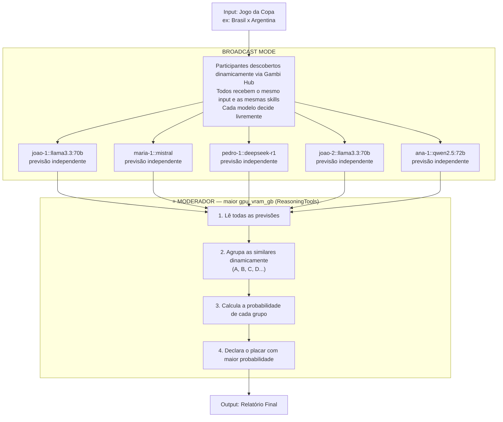

# Arquitetura — World Cup Score Predictor

Sistema distribuído onde múltiplas pessoas conectam seus modelos locais via **Gambi Hub**,
cada um analisa o mesmo jogo de forma independente com as mesmas skills, e o modelo
com mais poder de processamento (eleito automaticamente pelos specs do Gambi) atua como
**moderador** — agrupando os resultados dinamicamente e calculando a probabilidade de cada previsão.

---

## Fluxo



---

## Princípios

- **ID único** — `participant_id::model` garante distinção mesmo entre dois Joãos com o mesmo modelo.
- **Descoberta dinâmica** — `fetch_participants()` busca o estado atual da room; ninguém edita código para entrar no debate.
- **Eleição automática do moderador** — o participante com maior `gpu_vram_gb` nos specs do Gambi vira o moderador. Sem designação manual.
- **Skills compartilhadas** — todos os agentes recebem as mesmas instruções; a diferença está apenas no modelo local de cada um.

---

## Output esperado

O moderador cria os grupos dinamicamente — podem ser 2, 3 ou mais:

```
📊 PREVISÃO: Brasil x Argentina — Copa do Mundo 2026

GRUPO A — 60% de probabilidade
  Placar: Brasil 2 x 1 Argentina
  Modelos: joao-1::llama3.3:70b, maria-1::mistral, pedro-1::deepseek-r1
  Argumentos:
    - Brasil com melhor xG nos últimos 5 jogos
    - Sentimento popular 72% favorável ao Brasil no X
    - Argentina sem Messi em forma plena

GRUPO B — 20% de probabilidade
  Placar: Empate 1 x 1
  Modelos: joao-2::llama3.3:70b
  Argumentos:
    - Histórico de empates em fases de grupos
    - Defesa argentina sólida nos últimos 3 jogos

GRUPO C — 20% de probabilidade
  Placar: Argentina 1 x 0 Brasil
  Modelos: ana-1::qwen2.5:72b
  Argumentos:
    - Argentina venceu os últimos 2 confrontos diretos

🎯 Previsão Final: Brasil 2 x 1 Argentina (60% de confiança)
```

---

## Skills compartilhadas

Todos os agentes recebem as **mesmas skills** — a diferença está apenas no modelo local de cada participante.

```
skills/
├── stats-skill/
│   ├── SKILL.md              # xG, posse, gols, defesa, confrontos diretos
│   └── scripts/
│       └── fetch_stats.py    # APIs esportivas (ex: football-data.org)
│
├── tactical-skill/
│   ├── SKILL.md              # Formações, escalações, lesões, clima
│   └── references/
│       └── formations.md
│
└── sentiment-skill/
    ├── SKILL.md              # Opinião popular do X, Reddit, sites
    └── scripts/
        └── fetch_sentiment.py
```

---

## Mapeamento código ↔ fluxo

| Etapa do fluxo | Onde mora no código |
|---|---|
| Configuração (Hub URL, room code, API key) | [src/copa_gambi/core/config.py](../src/copa_gambi/core/config.py) |
| Schemas validados (`Participant`, `ParticipantSpecs`) | [src/copa_gambi/core/schemas.py](../src/copa_gambi/core/schemas.py) |
| Descoberta dinâmica + eleição do moderador | [src/copa_gambi/core/hub.py](../src/copa_gambi/core/hub.py) |
| Instruções compartilhadas + do moderador | [src/copa_gambi/agents/instructions.py](../src/copa_gambi/agents/instructions.py) |
| Fábrica de `Agent` + `OpenAILike` model | [src/copa_gambi/agents/factory.py](../src/copa_gambi/agents/factory.py) |
| Montagem do `Team` em broadcast mode | [src/copa_gambi/agents/team.py](../src/copa_gambi/agents/team.py) |
| Entry-point CLI (`participants`, `predict`) | [src/copa_gambi/cli/main.py](../src/copa_gambi/cli/main.py) |

---

## Stack & referências

| Componente | Descrição | Link |
|---|---|---|
| Gambi Hub | Conecta modelos locais distribuídos em rede | [gambi.sh/reference/cli](https://www.gambi.sh/reference/cli/) |
| OpenAILike | Aponta qualquer endpoint OpenAI-compatible | [docs.agno.com/models/providers/openai-like](https://docs.agno.com/models/providers/openai-like) |
| Broadcast Mode | Todos os agentes recebem o mesmo input em paralelo | [docs.agno.com/examples/teams/modes/broadcast/debate](https://docs.agno.com/examples/teams/modes/broadcast/debate) |
| ReasoningTools | Raciocínio estruturado no moderador | [docs.agno.com/reasoning/usage/tools/reasoning-tool-team](https://docs.agno.com/reasoning/usage/tools/reasoning-tool-team) |
| Teams Overview | Como times funcionam no Agno | [docs.agno.com/teams/overview](https://docs.agno.com/teams/overview) |
